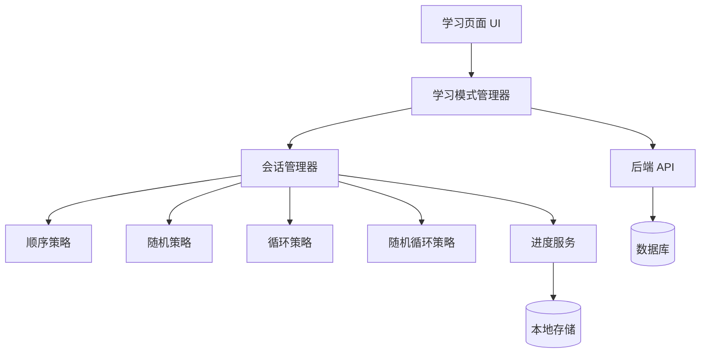

# 设计文档：学习模式功能

## 概述

本设计为英语学习系统的学习页面添加四种学习模式：顺序模式、随机模式、循环模式和随机循环模式。设计采用状态机模式管理学习会话，使用策略模式实现不同的单词选择算法。

## 架构

### 系统架构



### 模块职责

1. **学习模式管理器 (LearningModeManager)**
   - 管理学习模式的切换
   - 协调 UI 和会话管理器
   - 处理用户交互事件

2. **会话管理器 (SessionManager)**
   - 维护当前学习会话状态
   - 委托单词选择给具体策略
   - 管理学习进度

3. **单词选择策略 (WordSelectionStrategy)**
   - 定义单词选择接口
   - 实现四种具体策略

4. **进度服务 (ProgressService)**
   - 追踪学习进度
   - 持久化学习数据
   - 提供统计信息

## 组件和接口

### 前端组件

#### LearningModeSelector 组件

```typescript
interface LearningModeSelectorProps {
  currentMode: LearningMode;
  onModeChange: (mode: LearningMode) => void;
  disabled?: boolean;
}

enum LearningMode {
  SEQUENTIAL = 'sequential',
  RANDOM = 'random',
  LOOP = 'loop',
  RANDOM_LOOP = 'random_loop'
}
```

#### LearningSession 组件

```typescript
interface LearningSessionProps {
  lessonId: number;
  mode: LearningMode;
  onComplete: () => void;
}

interface LearningSessionState {
  currentWord: Word | null;
  progress: ProgressInfo;
  isLoading: boolean;
}
```

#### ProgressDisplay 组件

```typescript
interface ProgressDisplayProps {
  mode: LearningMode;
  progress: ProgressInfo;
}

interface ProgressInfo {
  currentIndex: number;
  totalWords: number;
  learnedCount: number;
  loopCount: number;
  sessionStartTime: Date;
}
```

### 后端接口

#### 学习会话 API

```typescript
// 创建学习会话
POST /api/learning/sessions
Request: {
  lessonId: number;
  mode: LearningMode;
}
Response: {
  sessionId: string;
  words: Word[];
  initialState: SessionState;
}

// 更新学习进度
PUT /api/learning/sessions/:sessionId/progress
Request: {
  wordId: number;
  correct: boolean;
  timeSpent: number;
}
Response: {
  nextWord: Word | null;
  progress: ProgressInfo;
}

// 获取会话状态
GET /api/learning/sessions/:sessionId
Response: {
  sessionId: string;
  mode: LearningMode;
  progress: ProgressInfo;
  currentState: SessionState;
}
```

## 数据模型

### 学习会话模型

```typescript
interface LearningSession {
  id: string;
  userId: number;
  lessonId: number;
  mode: LearningMode;
  startTime: Date;
  lastActivityTime: Date;
  state: SessionState;
  progress: ProgressInfo;
}

interface SessionState {
  wordSequence: number[];  // 单词 ID 序列
  currentIndex: number;    // 当前位置
  learnedWords: Set<number>; // 已学习的单词 ID
  loopCount: number;       // 循环次数
}
```

### 学习记录模型

```typescript
interface LearningRecord {
  id: number;
  sessionId: string;
  wordId: number;
  correct: boolean;
  timeSpent: number;  // 毫秒
  timestamp: Date;
}
```

## 单词选择策略实现

### 策略接口

```typescript
interface WordSelectionStrategy {
  initialize(words: Word[]): void;
  getNextWord(): Word | null;
  markWordLearned(wordId: number): void;
  getProgress(): ProgressInfo;
  reset(): void;
}
```

### 顺序策略 (SequentialStrategy)

```
算法：
1. 初始化时保持单词原始顺序
2. 维护当前索引指针
3. getNextWord() 返回当前索引的单词，索引+1
4. 到达末尾返回 null
```

### 随机策略 (RandomStrategy)

```
算法：
1. 初始化时创建未学习单词集合
2. getNextWord() 从未学习集合中随机选择
3. markWordLearned() 将单词从未学习集合移除
4. 当未学习集合为空时，提示完成一轮
5. 用户可选择重置开始新一轮
```

### 循环策略 (LoopStrategy)

```
算法：
1. 初始化时保持单词原始顺序
2. 维护当前索引和循环计数器
3. getNextWord() 返回当前索引的单词
4. 索引到达末尾时重置为 0，循环计数+1
5. 永不返回 null，持续循环
```

### 随机循环策略 (RandomLoopStrategy)

```
算法：
1. 初始化时随机打乱单词顺序
2. 维护当前索引和循环计数器
3. getNextWord() 返回当前索引的单词
4. 索引到达末尾时：
   a. 重新随机打乱单词顺序
   b. 重置索引为 0
   c. 循环计数+1
5. 永不返回 null，持续循环
```

## 状态管理

### 前端状态

使用 Vue 3 Composition API 管理状态：

```typescript
interface LearningState {
  mode: LearningMode;
  session: LearningSession | null;
  currentWord: Word | null;
  progress: ProgressInfo;
  isLoading: boolean;
  error: string | null;
}

// 使用 Pinia store
const useLearningStore = defineStore('learning', {
  state: (): LearningState => ({
    mode: LearningMode.SEQUENTIAL,
    session: null,
    currentWord: null,
    progress: {
      currentIndex: 0,
      totalWords: 0,
      learnedCount: 0,
      loopCount: 0,
      sessionStartTime: new Date()
    },
    isLoading: false,
    error: null
  }),
  
  actions: {
    async startSession(lessonId: number, mode: LearningMode),
    async loadNextWord(),
    async submitAnswer(wordId: number, correct: boolean),
    async switchMode(newMode: LearningMode),
    saveProgress()
  }
});
```

### 本地存储

```typescript
interface StoredLearningData {
  lastMode: LearningMode;
  sessionStates: {
    [lessonId: number]: {
      [mode: string]: SessionState;
    };
  };
  preferences: {
    autoSaveInterval: number;
    showProgress: boolean;
  };
}
```

## 错误处理

### 错误类型

```typescript
enum LearningError {
  SESSION_NOT_FOUND = 'SESSION_NOT_FOUND',
  INVALID_MODE = 'INVALID_MODE',
  NO_WORDS_AVAILABLE = 'NO_WORDS_AVAILABLE',
  NETWORK_ERROR = 'NETWORK_ERROR',
  STORAGE_ERROR = 'STORAGE_ERROR'
}

class LearningException extends Error {
  constructor(
    public code: LearningError,
    message: string,
    public details?: any
  ) {
    super(message);
  }
}
```

### 错误处理策略

1. **网络错误**: 自动重试 3 次，失败后提示用户
2. **会话丢失**: 尝试从本地存储恢复，失败则创建新会话
3. **无可用单词**: 提示用户课程为空，返回课程列表
4. **存储错误**: 降级到内存模式，警告用户进度不会保存

## 性能优化

### 前端优化

1. **单词预加载**: 提前加载下 3 个单词的音频
2. **虚拟滚动**: 进度列表使用虚拟滚动
3. **防抖处理**: 用户输入使用 300ms 防抖
4. **懒加载**: 模式切换时懒加载对应策略代码

### 后端优化

1. **会话缓存**: 使用 Redis 缓存活跃会话
2. **批量查询**: 一次性加载课程所有单词
3. **索引优化**: 为 session_id 和 user_id 添加索引
4. **连接池**: 使用数据库连接池

## 测试策略

### 单元测试

- 测试每个单词选择策略的算法正确性
- 测试状态管理的状态转换
- 测试进度计算的准确性
- 测试错误处理逻辑

### 集成测试

- 测试前后端 API 交互
- 测试本地存储持久化
- 测试模式切换流程
- 测试会话恢复功能

### 端到端测试

- 测试完整的学习流程
- 测试不同模式的用户体验
- 测试跨设备数据同步
- 测试网络异常场景


## 正确性属性

属性是一个特征或行为，应该在系统的所有有效执行中保持为真——本质上是关于系统应该做什么的形式化陈述。属性作为人类可读规范和机器可验证正确性保证之间的桥梁。

### 属性 1: 模式激活一致性

对于任意选择的学习模式，当用户激活该模式时，系统应该创建对应模式的学习会话，并且会话的模式字段应该与用户选择的模式匹配。

**验证需求: 1.3, 1.4**

### 属性 2: 模式切换进度保留

对于任意两种学习模式 M1 和 M2，当用户从 M1 切换到 M2 时，切换前的学习进度统计（已学习单词数、学习时间）应该在切换后仍然可访问。

**验证需求: 1.5, 5.5**

### 属性 3: 随机模式无重复保证

对于任意单词集合 W，在随机模式下，系统应该确保在 |W| 次选择内，每个单词都被选择恰好一次，不存在重复。

**验证需求: 2.3**

### 属性 4: 随机选择有效性

对于任意非空单词集合 W，随机模式选择的下一个单词应该始终是 W 中的一个元素。

**验证需求: 2.1, 2.2**

### 属性 5: 学习次数准确性

对于任意单词 w 和学习会话，如果 w 被学习了 n 次，那么系统记录的该单词学习次数应该等于 n。

**验证需求: 2.6**

### 属性 6: 循环模式序列连续性

对于任意单词序列 [w1, w2, ..., wn]，在循环模式下，如果当前单词是 wi（i < n），那么下一个单词应该是 w(i+1)；如果当前单词是 wn，那么下一个单词应该是 w1。

**验证需求: 3.2, 3.3**

### 属性 7: 位置显示准确性

对于任意单词 w 在序列中的位置 i，系统显示的位置应该等于 i。

**验证需求: 3.4, 4.5**

### 属性 8: 循环计数递增性

对于任意循环模式（循环或随机循环），每当完成一轮所有单词的学习后，循环计数应该恰好增加 1。

**验证需求: 3.5, 4.6**

### 属性 9: 随机循环排列完整性

对于任意单词集合 W，在随机循环模式的每一轮中，展示的单词集合应该是 W 的一个排列（包含所有元素，每个元素恰好一次）。

**验证需求: 4.4**

### 属性 10: 随机打乱有效性

对于任意单词集合 W，随机循环模式打乱后的序列应该包含 W 中的所有单词，且每个单词恰好出现一次。

**验证需求: 4.1**

### 属性 11: 进度计数一致性

对于任意学习会话，已学习单词数 + 未学习单词数应该始终等于课程总单词数。

**验证需求: 5.3**

### 属性 12: 总数显示准确性

对于任意课程 L，系统显示的总单词数应该等于 L 中实际包含的单词数量。

**验证需求: 5.2**

### 属性 13: 持久化往返一致性

对于任意学习模式 M 和学习进度 P，如果系统保存了 (M, P)，那么重新加载后应该得到相同的 (M, P)。

**验证需求: 7.1, 7.2, 7.3, 7.5**

### 属性 14: 登出保存完整性

对于任意学习数据 D，在用户登出前保存 D，登出后重新登录，恢复的数据应该等于 D。

**验证需求: 7.4, 7.5**

### 属性 15: 会话重置正确性

对于任意学习模式，当用户选择开始新一轮学习时，已学习单词集合应该被清空，循环计数应该重置为 0（或增加 1，取决于模式）。

**验证需求: 2.5**

